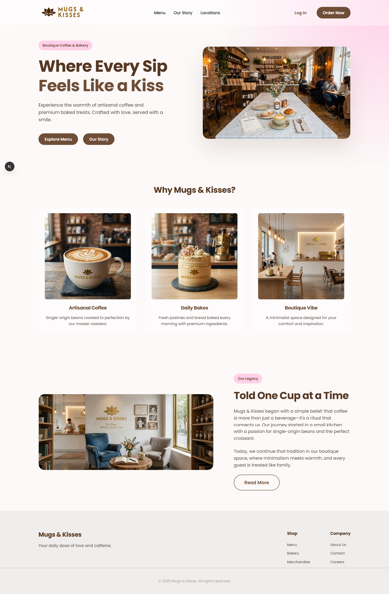

# ☕ Mugs & Kisses WebApp

**Mugs & Kisses** is a modern, responsive, and beautifully designed boutique coffee shop and bakery web application. It features a premium "Boutique Minimalism" aesthetic with advanced glassmorphism UI elements, providing users with a seamless browsing and ordering experience.

 <!-- Ensure you upload the actual images to GitHub -->

## ✨ Features

- **Premium UI/UX**: Built with custom vanilla CSS focusing on boutique minimalism, soft shadows, interactive micro-animations, and glassmorphism.
- **Responsive Layouts**: Fully responsive grid and flexbox designs that look stunning on desktop, tablet, and mobile devices.
- **Firebase Authentication**: Secure user registration and login system seamlessly integrated with Google Firebase Auth.
- **User Dashboard**: A personalized user portal featuring:
  - Welcome and profile summary
  - Recent order tracking with interactive status badges
  - Quick action links (Order, Profile, Favorites)
  - Favorite items management
  - Dynamic notification UI
- **Firebase Realtime Database**: Ready-to-use integration for storing user profiles, orders, and favorites securely.
- **Fast Performance**: Leveraging Next.js 13+ App Router for rapid page loads and optimized image delivery.

## 🛠️ Tech Stack

- **Framework**: [Next.js](https://nextjs.org/) (App Router)
- **Library**: [React 19](https://react.dev/)
- **Styling**: Pure CSS (Globals with advanced CSS Variables & Glassmorphism)
- **Backend & Auth**: [Firebase](https://firebase.google.com/) (Authentication & Realtime Database)
- **Hosting**: Vercel (Recommended)

## 📂 Project Structure

```text
├── app/
│   ├── about/            # Our Story page
│   ├── dashboard/        # Authenticated User Dashboard
│   ├── locations/        # Store Locations page
│   ├── login/            # Firebase Sign In page
│   ├── menu/             # Explore Menu page
│   ├── order/            # Ordering interface
│   ├── register/         # Firebase Sign Up page
│   ├── globals.css       # Core Design System, Tokens, and Global Styles
│   ├── layout.js         # Root application layout
│   └── page.js           # Main Landing / Hero page
├── components/
│   ├── Header.js         # Global Navigation Bar
│   └── Hero.js           # Landing page hero section
├── lib/
│   └── firebase.js       # Firebase initialization and configuration
├── public/               # Static assets (images, logos, fonts)
└── package.json          # Dependencies and scripts
```

## 🚀 Getting Started

To get a local copy up and running, follow these simple steps.

### Prerequisites
Make sure you have Node.js installed on your machine.
* npm
  ```sh
  npm install npm@latest -g
  ```

### Installation

1. **Clone the repository**
   ```sh
   git clone https://github.com/your-username/mugs-and-kisses.git
   ```
2. **Navigate into the directory**
   ```sh
   cd mugs-and-kisses
   ```
3. **Install NPM packages**
   ```sh
   npm install
   ```
4. **Configure Firebase**
   - Head to the [Firebase Console](https://console.firebase.google.com/) and create a project.
   - Enable **Authentication** (Email/Password) and **Realtime Database**.
   - Copy your Web App SDK config and place it inside `lib/firebase.js`.

5. **Run the development server**
   ```sh
   npm run dev
   ```
   Open [http://localhost:3000](http://localhost:3000) to view it in your browser.

## 🎨 Design System

The application uses a highly customized CSS architecture located in `globals.css`:
- **Color Palette**: Mocha (`#6F4E37`), Soft Pink (`#F7C8E0`), and Cream (`#fcf9f8`) for a warm, inviting feel.
- **Glassmorphism**: Reusable `.glass` utility class applying `rgba` backgrounds and backdrop filters for depth.
- **Buttons**: Uniform interactive states with hover translation effects mimicking native app interactions.

## 🤝 Contributing

Contributions are what make the open source community such an amazing place to learn, inspire, and create. Any contributions you make are **greatly appreciated**.

1. Fork the Project
2. Create your Feature Branch (`git checkout -b feature/AmazingFeature`)
3. Commit your Changes (`git commit -m 'Add some AmazingFeature'`)
4. Push to the Branch (`git push origin feature/AmazingFeature`)
5. Open a Pull Request

## 📝 License

Distributed under the MIT License. See `LICENSE` for more information.

---
*Built with ❤️ for coffee lovers @Mohamad Sukri Instagram:- @prince_photographys.*
